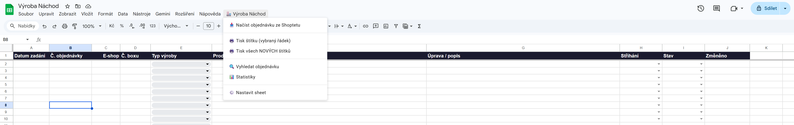

# Automatizace výrobních procesů a datová analytika

Interní systém pro řízení výroby, kalkulaci a cenotvorbu šitých výrobků, analýzu produktového portfolia a plánování personálních kapacit v e-shop firmě.

## Projekt řeší následující oblasti
- digitalizaci výrobního procesu
- automatizaci výpočtů spotřeby materiálu a cenotvorby šitých výrobků
- analýzu produktového portfolia
- plánování kapacit a alokaci pracovníků ve skladu

## Co jsem vytvořil
- kalkulátor cen šitých výrobků
- kalkulátor střihů pro výrobu
- systém řízení výroby v Google Sheets
- automatické generování výrobních štítků
- analytické dashboardy produktového portfolia
- interní dashboard pro řízení personálních kapacit skladu

## Technologie
- Google Sheets
- Google Apps Script
- JavaScript / HTML
- Lightdash (BI dashboardy)
- Claude Code
- React / moderní webové UI
- API integrace

## Business přínos
- snížení manuální administrativy ve výrobě
- standardizace cenotvorby šitých výrobků
- eliminace chyb při výrobě
- datové podklady pro plánování sortimentu a výroby
- lepší rozdělení pracovníků podle aktuální zátěže skladu
- rychlejší identifikace bottlenecků a rizika přesčasů

## Ukázky systémů
Vybrané screenshoty z interních nástrojů. Některé dashboardy a části systému nejsou zveřejněny z důvodu citlivých firemních dat.

### Dashboardy – analýza prodejů ručníků

### Kalkulátor šití – výpočet spotřeby látky

### Systém digitalizace výroby – evidence výrobních zakázek

### Dashboard řízení kapacit skladu
Interní nástroj pro plánování směny, rozdělení pracovníků mezi picking, balení, střihání, příjem a výrobní činnosti. Systém automaticky vyhodnocuje vytížení jednotlivých aktivit, odhaluje bottlenecky, počítá očekávané dokončení a navrhuje přesun pracovníků mezi činnostmi.

## Další ukázky

Kompletní screenshoty projektu a další ukázky systémů jsou dostupné v repozitáři na GitHubu:

[Otevřít celý repozitář](https://github.com/josidostal/Portfolio)
